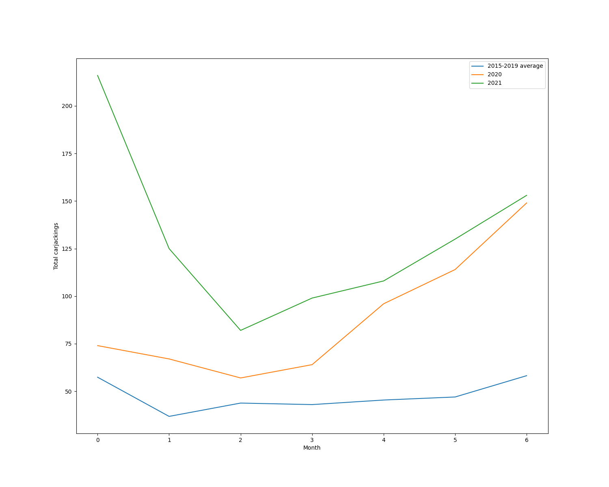

# chicago-carjacking-tracker

---

## Data current through August 16, 2021

| month                  |   2015 |   2016 |   2017 |   2018 |   2019 |   2020 |   2021 |
|:-----------------------|-------:|-------:|-------:|-------:|-------:|-------:|-------:|
| January                |     26 |     51 |     75 |     86 |     49 |     74 |    216 |
| February               |     11 |     36 |     56 |     51 |     30 |     67 |    125 |
| March                  |     29 |     41 |     58 |     60 |     31 |     57 |     82 |
| April                  |     23 |     34 |     64 |     49 |     45 |     64 |     99 |
| May                    |     19 |     47 |     63 |     49 |     49 |     96 |    108 |
| June                   |     17 |     39 |     74 |     58 |     47 |    114 |    130 |
| July                   |     37 |     54 |     75 |     72 |     53 |    149 |    155 |
| August (through 08-16) |     19 |     42 |     40 |     26 |     21 |    101 |     91 |
| Total                  |    181 |    344 |    505 |    451 |    325 |    722 |   1006 |

