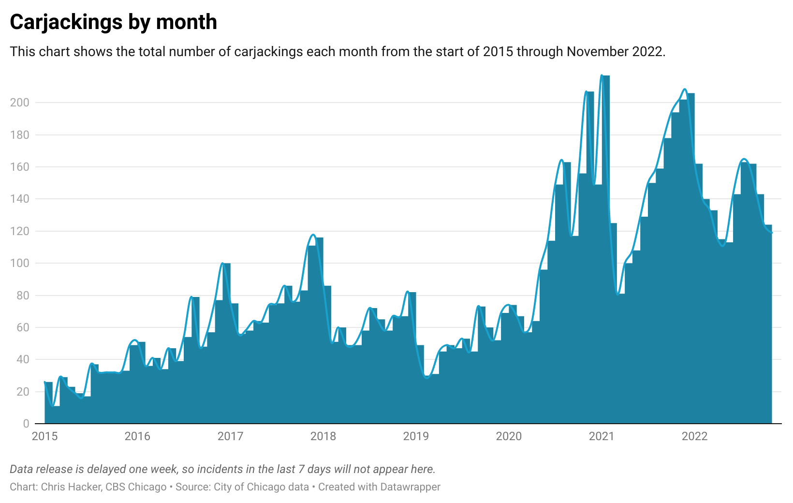
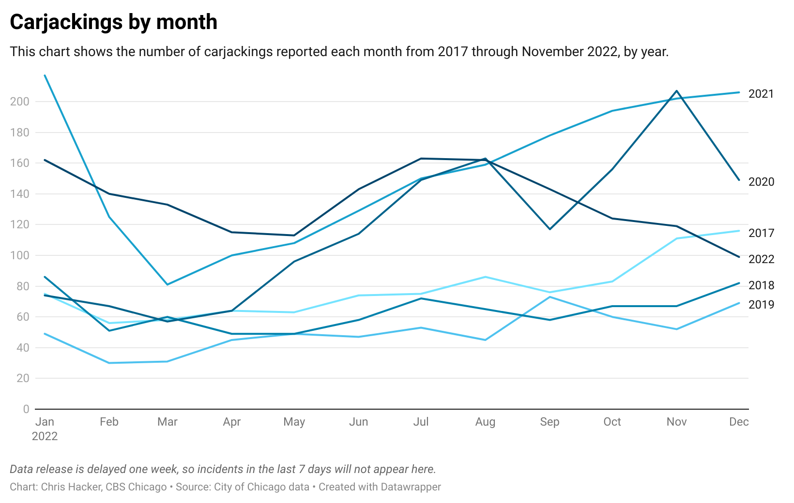

# Tracking carjackings in Chicago

This repository contains the latest data from the [Chicago Data Portal](https://data.cityofchicago.org) on vehicular hijackings, also known as carjackings, in the city. 
The csv files in `output/` are used to populate graphics hosted at [cbschicago.com/carjackings](https://cbschicago.com/carjackings), as well as to inform our reporting on-air at [CBS Chicago](https://cbschicago.com).

[Click here for excel files](output/excel/)

---

## Data current through February 27, 2022

| month     |   2015 |   2016 |   2017 |   2018 |   2019 |   2020 |   2021 |   2022 (through 02-27) |
|:----------|-------:|-------:|-------:|-------:|-------:|-------:|-------:|-----------------------:|
| January   |     26 |     51 |     75 |     86 |     49 |     74 |    217 |                    159 |
| February  |     11 |     36 |     56 |     51 |     30 |     67 |    125 |                    136 |
| March     |     29 |     41 |     58 |     60 |     31 |     57 |     81 |                    nan |
| April     |     23 |     34 |     64 |     49 |     45 |     64 |    100 |                    nan |
| May       |     19 |     47 |     63 |     49 |     49 |     96 |    108 |                    nan |
| June      |     17 |     39 |     74 |     58 |     47 |    114 |    130 |                    nan |
| July      |     37 |     54 |     75 |     72 |     53 |    149 |    149 |                    nan |
| August    |     32 |     79 |     86 |     65 |     45 |    163 |    160 |                    nan |
| September |     32 |     48 |     76 |     58 |     73 |    117 |    178 |                    nan |
| October   |     32 |     57 |     83 |     67 |     60 |    156 |    195 |                    nan |
| November  |     33 |     77 |    111 |     67 |     52 |    207 |    203 |                    nan |
| December  |     49 |    100 |    116 |     82 |     69 |    149 |    206 |                    nan |
| Total     |    340 |    663 |    937 |    764 |    603 |   1413 |   1852 |                    295 |

| month                    |   2015 |   2016 |   2017 |   2018 |   2019 |   2020 |   2021 |   2022 |
|:-------------------------|-------:|-------:|-------:|-------:|-------:|-------:|-------:|-------:|
| January                  |     26 |     51 |     75 |     86 |     49 |     74 |    217 |    159 |
| February (through 02-27) |     10 |     36 |     55 |     51 |     29 |     67 |    120 |    136 |
| Total                    |     36 |     87 |    130 |    137 |     78 |    141 |    337 |    295 |

