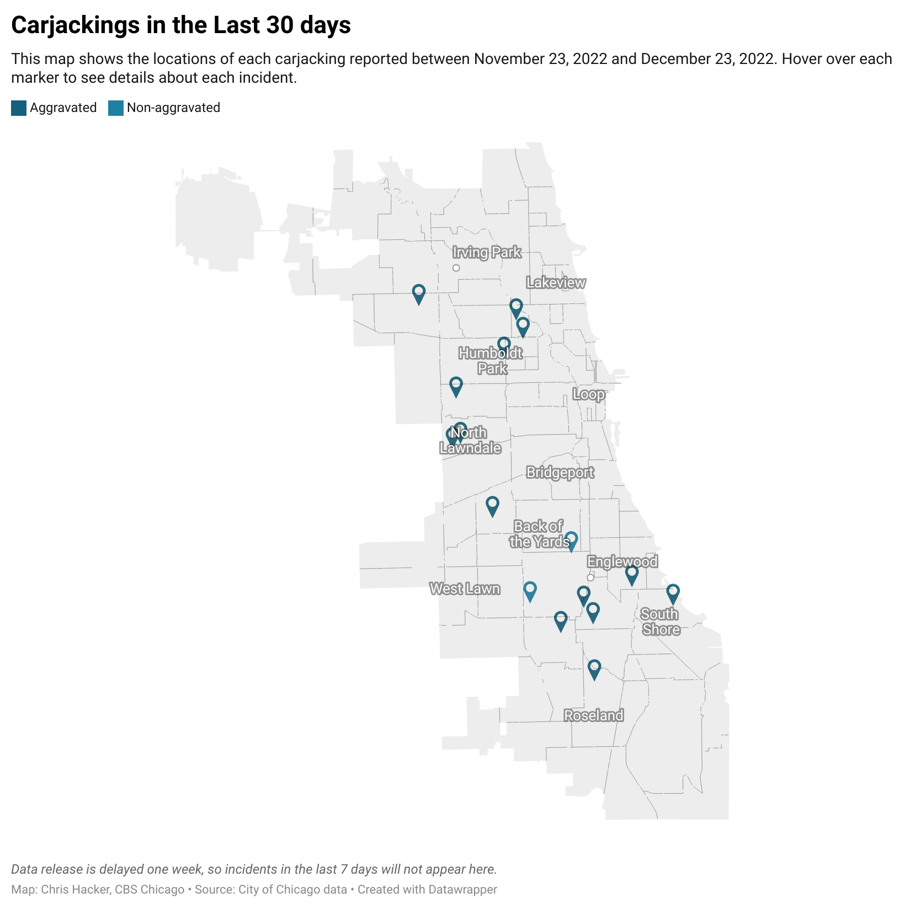
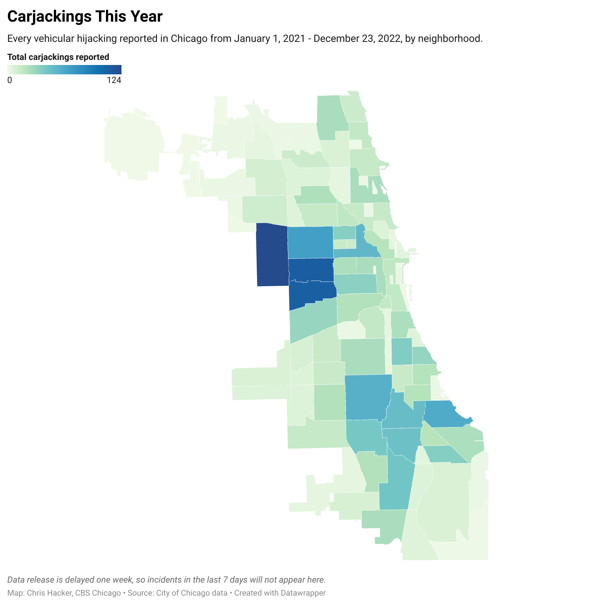

# Tracking carjackings in Chicago

This repository contains the latest data from the [Chicago Data Portal](https://data.cityofchicago.org) on vehicular hijackings, also known as carjackings, in the city. 
The csv files in `output/` are used to populate graphics hosted at [cbschicago.com/carjackings](https://cbschicago.com/carjackings), as well as to inform our reporting on-air at [CBS Chicago](https://cbschicago.com).

[Click here for excel files](output/excel/)

---

## Data current through January 24, 2022

| month                   |   2015 |   2016 |   2017 |   2018 |   2019 |   2020 |   2021 |   2022 |
|:------------------------|-------:|-------:|-------:|-------:|-------:|-------:|-------:|-------:|
| January (through 01-24) |     24 |     38 |     58 |     73 |     40 |     51 |    188 |    133 |
| Total                   |     24 |     38 |     58 |     73 |     40 |     51 |    188 |    133 |

